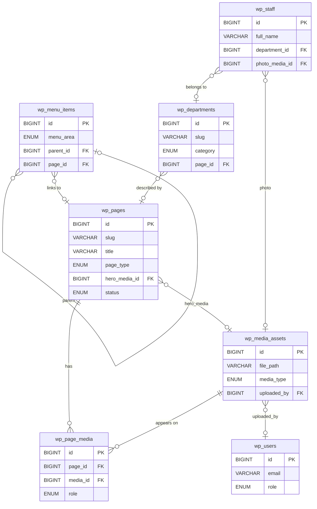
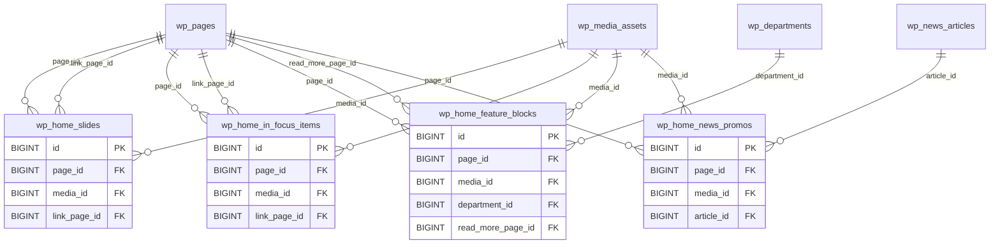
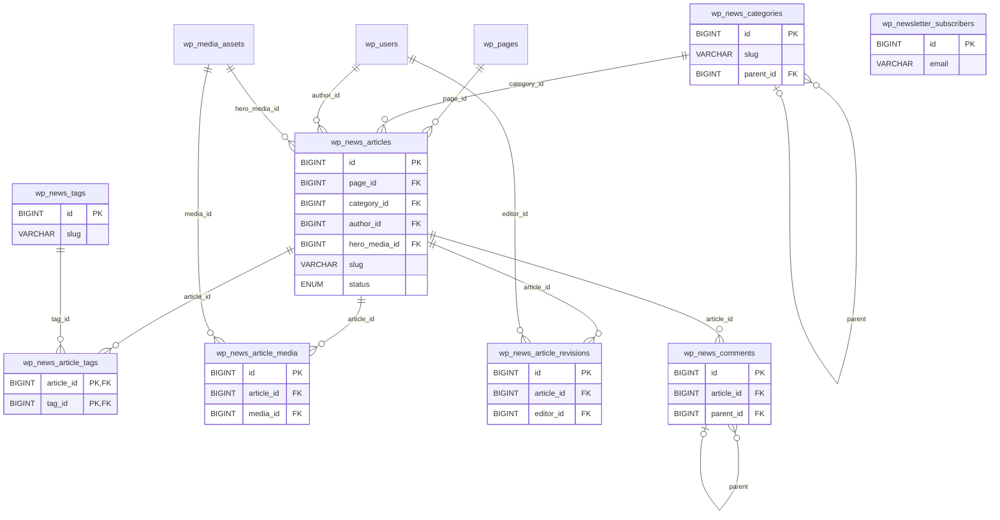
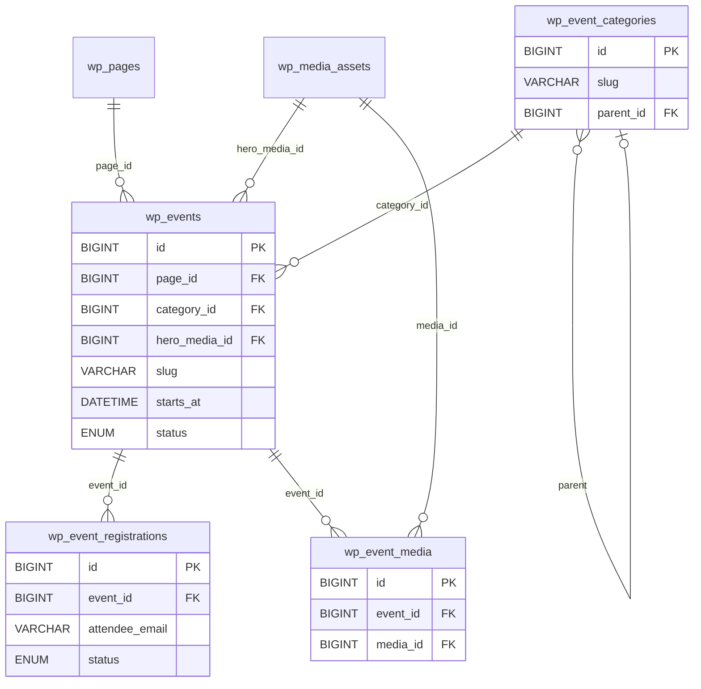
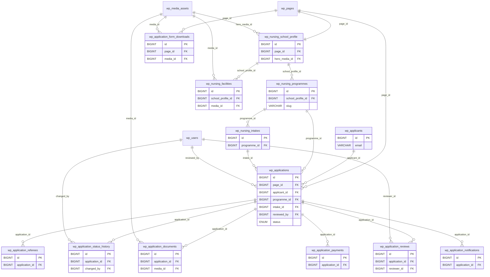

# Consolidated Entity-Relationship Diagram (ERD)

This document is the **single-source ERD** for the entire OLLMH dynamic website
schema. It covers all **80 tables** (7 shared/platform + 73 page-specific) and
their **116 foreign-key relationships**, grouped into logical clusters.

For table definitions and column-level details, see:
- [`SCHEMA_CONVENTIONS.md`](./SCHEMA_CONVENTIONS.md) — the 7 shared tables.
- [`pages/`](./pages/) — one file per page with its own `CREATE TABLE` statements.

> **How to read this document:** Mermaid `erDiagram` blocks render inline on
> GitHub. Each cluster diagram shows only the tables in that cluster plus the
> shared tables they reference (shown in a lighter style). The final
> "Cross-cluster" diagram shows how the clusters connect through shared tables.

---

## Cluster 1 — Platform core (shared tables)

Defined in [`SCHEMA_CONVENTIONS.md`](./SCHEMA_CONVENTIONS.md). Every other
cluster foreign-keys into these.

---

## Cluster 2 — Home page

Defined in [`pages/index.md`](./pages/index.md).

---

## Cluster 3 — News (feed + articles)

Defined in [`pages/news/index.md`](./pages/news/index.md) (feed/taxonomy) and
[`pages/news/article-template.md`](./pages/news/article-template.md) (articles).

---

## Cluster 4 — Events (calendar + event pages)

Defined in [`pages/events/index.md`](./pages/events/index.md) (calendar/taxonomy)
and [`pages/events/event-template.md`](./pages/events/event-template.md)
(individual events).

---

## Cluster 5 — Nursing school & application workflow

Defined in [`pages/about-nursing-school.md`](./pages/about-nursing-school.md)
and [`pages/medical-school-application-form.md`](./pages/medical-school-application-form.md).

---

## Cluster 6 — Departments, wards & clinical services

Defined in [`pages/ollmh-wp_departments.md`](./pages/ollmh-wp_departments.md),
[`pages/wp_wards.md`](./pages/wp_wards.md),
[`pages/out-patient-dept.md`](./pages/out-patient-dept.md),
[`pages/in-patient-dept.md`](./pages/in-patient-dept.md),
[`pages/special-medical-services.md`](./pages/special-medical-services.md),
and [`pages/clinic-days.md`](./pages/clinic-days.md).

```mermaid
erDiagram
    wp_pages ||--o{ wp_department_showcase : "page_id"
    wp_departments ||--o{ wp_department_showcase : "department_id"
    wp_staff ||--o{ wp_department_showcase : "head_staff_id"
    wp_media_assets ||--o{ wp_department_showcase : "cover_media_id"
    wp_departments ||--o{ wp_department_photos : "department_id"
    wp_media_assets ||--o{ wp_department_photos : "media_id"

    wp_pages ||--o{ wp_wards : "page_id"
    wp_departments ||--o{ wp_wards : "department_id"
    wp_staff ||--o{ wp_wards : "in_charge_id"
    wp_wards ||--o{ wp_ward_media : "ward_id"
    wp_media_assets ||--o{ wp_ward_media : "media_id"
    wp_pages ||--o{ wp_mortuary_services : "page_id"
    wp_wards ||--o{ wp_mortuary_services : "ward_id"
    wp_wards ||--o{ wp_ward_bed_status : "ward_id"
    wp_users ||--o{ wp_ward_bed_status : "recorded_by"

    wp_pages ||--o{ wp_opd_facilities : "page_id"
    wp_departments ||--o{ wp_opd_facilities : "department_id"
    wp_departments ||--o{ wp_opd_operating_hours : "department_id"
    wp_departments ||--o{ wp_opd_consultation_rooms : "department_id"
    wp_departments ||--o{ wp_opd_appointments : "department_id"
    wp_opd_consultation_rooms ||--o{ wp_opd_appointments : "room_id"
    wp_staff ||--o{ wp_opd_appointments : "clinician_id"

    wp_pages ||--o{ wp_inpatient_dept_sections : "page_id"
    wp_departments ||--o{ wp_inpatient_dept_sections : "department_id"
    wp_media_assets ||--o{ wp_inpatient_dept_sections : "hero_media_id"
    wp_departments ||--o{ wp_inpatient_admission_enquiries : "department_id"

    wp_pages ||--o{ wp_special_medical_services : "page_id"
    wp_departments ||--o{ wp_special_medical_services : "department_id"
    wp_media_assets ||--o{ wp_special_medical_services : "hero_media_id"
    wp_special_medical_services ||--o{ wp_service_specialists : "service_id"
    wp_staff ||--o{ wp_service_specialists : "staff_id"
    wp_special_medical_services ||--o{ wp_service_equipment : "service_id"
    wp_pages ||--o{ wp_service_equipment : "page_id"
    wp_media_assets ||--o{ wp_service_equipment : "media_id"
    wp_special_medical_services ||--o{ wp_service_enquiries : "service_id"

    wp_pages ||--o{ wp_clinics : "page_id"
    wp_departments ||--o{ wp_clinics : "department_id"
    wp_clinics ||--o{ wp_clinic_schedules : "clinic_id"
    wp_staff ||--o{ wp_clinic_schedules : "clinician_id"
    wp_clinic_schedules ||--o{ wp_clinic_schedule_exceptions : "schedule_id"
    wp_clinic_schedules ||--o{ wp_clinic_bookings : "schedule_id"

    wp_department_showcase {
        BIGINT id PK
        BIGINT page_id FK
        BIGINT department_id FK
        BIGINT head_staff_id FK
        BIGINT cover_media_id FK
    }
    wp_department_photos {
        BIGINT id PK
        BIGINT department_id FK
        BIGINT media_id FK
    }
    wp_wards {
        BIGINT id PK
        BIGINT page_id FK
        BIGINT department_id FK
        BIGINT in_charge_id FK
    }
    wp_ward_media {
        BIGINT id PK
        BIGINT ward_id FK
        BIGINT media_id FK
    }
    wp_mortuary_services {
        BIGINT id PK
        BIGINT page_id FK
        BIGINT ward_id FK
    }
    wp_ward_bed_status {
        BIGINT id PK
        BIGINT ward_id FK
        BIGINT recorded_by FK
    }
    wp_opd_facilities {
        BIGINT id PK
        BIGINT page_id FK
        BIGINT department_id FK
    }
    wp_opd_operating_hours {
        BIGINT id PK
        BIGINT department_id FK
    }
    wp_opd_consultation_rooms {
        BIGINT id PK
        BIGINT department_id FK
    }
    wp_opd_appointments {
        BIGINT id PK
        BIGINT department_id FK
        BIGINT room_id FK
        BIGINT clinician_id FK
    }
    wp_inpatient_dept_sections {
        BIGINT id PK
        BIGINT page_id FK
        BIGINT department_id FK
        BIGINT hero_media_id FK
    }
    wp_inpatient_admission_enquiries {
        BIGINT id PK
        BIGINT department_id FK
    }
    wp_special_medical_services {
        BIGINT id PK
        BIGINT page_id FK
        BIGINT department_id FK
        BIGINT hero_media_id FK
    }
    wp_service_specialists {
        BIGINT id PK
        BIGINT service_id FK
        BIGINT staff_id FK
    }
    wp_service_equipment {
        BIGINT id PK
        BIGINT service_id FK
        BIGINT page_id FK
        BIGINT media_id FK
    }
    wp_service_enquiries {
        BIGINT id PK
        BIGINT service_id FK
    }
    wp_clinics {
        BIGINT id PK
        BIGINT page_id FK
        BIGINT department_id FK
    }
    wp_clinic_schedules {
        BIGINT id PK
        BIGINT clinic_id FK
        BIGINT clinician_id FK
    }
    wp_clinic_schedule_exceptions {
        BIGINT id PK
        BIGINT schedule_id FK
    }
    wp_clinic_bookings {
        BIGINT id PK
        BIGINT schedule_id FK
    }
```

---

## Cluster 7 — Projects, community & sustainability

Defined in [`pages/development-projects.md`](./pages/development-projects.md),
[`pages/upcoming-projects.md`](./pages/upcoming-projects.md),
[`pages/self-sustainability-projects.md`](./pages/self-sustainability-projects.md),
[`pages/community-support.md`](./pages/community-support.md), and
[`pages/smi-community.md`](./pages/smi-community.md).

```mermaid
erDiagram
    wp_pages ||--o{ wp_development_projects : "page_id"
    wp_departments ||--o{ wp_development_projects : "department_id"
    wp_media_assets ||--o{ wp_development_projects : "cover_media_id"
    wp_pages ||--o{ wp_development_strategic_plans : "page_id"
    wp_media_assets ||--o{ wp_development_strategic_plans : "document_media_id"
    wp_development_projects ||--o{ wp_development_project_plan_links : "project_id"
    wp_development_strategic_plans ||--o{ wp_development_project_plan_links : "plan_id"
    wp_development_projects ||--o{ wp_development_project_media : "project_id"
    wp_media_assets ||--o{ wp_development_project_media : "media_id"
    wp_development_projects ||--o{ wp_development_project_metrics : "project_id"

    wp_pages ||--o{ wp_upcoming_projects : "page_id"
    wp_departments ||--o{ wp_upcoming_projects : "department_id"
    wp_pages ||--o{ wp_upcoming_projects : "related_page_id"
    wp_media_assets ||--o{ wp_upcoming_projects : "cover_media_id"
    wp_upcoming_projects ||--o{ wp_upcoming_project_phases : "project_id"
    wp_upcoming_projects ||--o{ wp_upcoming_project_media : "project_id"
    wp_media_assets ||--o{ wp_upcoming_project_media : "media_id"
    wp_upcoming_projects ||--o{ wp_upcoming_project_pledges : "project_id"

    wp_pages ||--o{ wp_sustainability_projects : "page_id"
    wp_media_assets ||--o{ wp_sustainability_projects : "cover_media_id"
    wp_sustainability_projects ||--o{ wp_sustainability_production_records : "project_id"
    wp_sustainability_projects ||--o{ wp_sustainability_project_media : "project_id"
    wp_media_assets ||--o{ wp_sustainability_project_media : "media_id"

    wp_pages ||--o{ wp_community_programs : "page_id"
    wp_departments ||--o{ wp_community_programs : "department_id"
    wp_media_assets ||--o{ wp_community_programs : "cover_media_id"
    wp_community_programs ||--o{ wp_community_outreach_events : "program_id"
    wp_community_programs ||--o{ wp_community_volunteer_signups : "program_id"
    wp_community_programs ||--o{ wp_community_program_media : "program_id"
    wp_media_assets ||--o{ wp_community_program_media : "media_id"

    wp_pages ||--o{ wp_smi_community_profile : "page_id"
    wp_media_assets ||--o{ wp_smi_community_profile : "cover_media_id"
    wp_pages ||--o{ wp_smi_facilities : "page_id"
    wp_media_assets ||--o{ wp_smi_facilities : "cover_media_id"
    wp_pages ||--o{ wp_smi_community_events : "page_id"
    wp_media_assets ||--o{ wp_smi_community_events : "cover_media_id"
    wp_pages ||--o{ wp_smi_vocation_enquiries : "page_id"
    wp_smi_community_events ||--o{ wp_smi_event_media : "event_id"
    wp_media_assets ||--o{ wp_smi_event_media : "media_id"

    wp_development_projects {
        BIGINT id PK
        BIGINT page_id FK
        BIGINT department_id FK
        BIGINT cover_media_id FK
    }
    wp_development_strategic_plans {
        BIGINT id PK
        BIGINT page_id FK
        BIGINT document_media_id FK
    }
    wp_development_project_plan_links {
        BIGINT id PK
        BIGINT project_id FK
        BIGINT plan_id FK
    }
    wp_development_project_media {
        BIGINT id PK
        BIGINT project_id FK
        BIGINT media_id FK
    }
    wp_development_project_metrics {
        BIGINT id PK
        BIGINT project_id FK
    }
    wp_upcoming_projects {
        BIGINT id PK
        BIGINT page_id FK
        BIGINT department_id FK
        BIGINT related_page_id FK
        BIGINT cover_media_id FK
    }
    wp_upcoming_project_phases {
        BIGINT id PK
        BIGINT project_id FK
    }
    wp_upcoming_project_media {
        BIGINT id PK
        BIGINT project_id FK
        BIGINT media_id FK
    }
    wp_upcoming_project_pledges {
        BIGINT id PK
        BIGINT project_id FK
    }
    wp_sustainability_projects {
        BIGINT id PK
        BIGINT page_id FK
        BIGINT cover_media_id FK
    }
    wp_sustainability_production_records {
        BIGINT id PK
        BIGINT project_id FK
    }
    wp_sustainability_project_media {
        BIGINT id PK
        BIGINT project_id FK
        BIGINT media_id FK
    }
    wp_community_programs {
        BIGINT id PK
        BIGINT page_id FK
        BIGINT department_id FK
        BIGINT cover_media_id FK
    }
    wp_community_outreach_events {
        BIGINT id PK
        BIGINT program_id FK
    }
    wp_community_volunteer_signups {
        BIGINT id PK
        BIGINT program_id FK
    }
    wp_community_program_media {
        BIGINT id PK
        BIGINT program_id FK
        BIGINT media_id FK
    }
    wp_smi_community_profile {
        BIGINT id PK
        BIGINT page_id FK
        BIGINT cover_media_id FK
    }
    wp_smi_facilities {
        BIGINT id PK
        BIGINT page_id FK
        BIGINT cover_media_id FK
    }
    wp_smi_community_events {
        BIGINT id PK
        BIGINT page_id FK
        BIGINT cover_media_id FK
    }
    wp_smi_vocation_enquiries {
        BIGINT id PK
        BIGINT page_id FK
    }
    wp_smi_event_media {
        BIGINT id PK
        BIGINT event_id FK
        BIGINT media_id FK
    }
```

---

## Cluster 8 — About, administration & philosophy

Defined in [`pages/about-ollmh-location.md`](./pages/about-ollmh-location.md),
[`pages/administration.md`](./pages/administration.md),
[`pages/philosophy-of-care.md`](./pages/philosophy-of-care.md),
[`pages/hr-capacity-wp_staff.md`](./pages/hr-capacity-wp_staff.md),
[`pages/ollmh-outlook.md`](./pages/ollmh-outlook.md), and
[`pages/contacts.md`](./pages/contacts.md).

```mermaid
erDiagram
    wp_pages ||--o{ wp_about_facts : "page_id"
    wp_pages ||--o{ wp_about_milestones : "page_id"
    wp_media_assets ||--o{ wp_about_milestones : "media_id"
    wp_pages ||--o{ wp_location_info : "page_id"

    wp_pages ||--o{ wp_governance_bodies : "page_id"
    wp_governance_bodies ||--o{ wp_governance_members : "body_id"
    wp_staff ||--o{ wp_governance_members : "staff_id"
    wp_media_assets ||--o{ wp_governance_members : "photo_media_id"

    wp_pages ||--o{ wp_care_statements : "page_id"
    wp_pages ||--o{ wp_care_values : "page_id"

    wp_pages ||--o{ wp_staff_cadres : "page_id"
    wp_pages ||--o{ wp_hr_capacity_stats : "page_id"
    wp_staff_cadres ||--o{ wp_hr_capacity_stats : "cadre_id"
    wp_departments ||--o{ wp_hr_capacity_stats : "department_id"
    wp_pages ||--o{ wp_job_vacancies : "page_id"
    wp_staff_cadres ||--o{ wp_job_vacancies : "cadre_id"
    wp_departments ||--o{ wp_job_vacancies : "department_id"

    wp_pages ||--o{ wp_outlook_albums : "page_id"
    wp_media_assets ||--o{ wp_outlook_albums : "cover_media_id"
    wp_pages ||--o{ wp_outlook_gallery_items : "page_id"
    wp_outlook_albums ||--o{ wp_outlook_gallery_items : "album_id"
    wp_media_assets ||--o{ wp_outlook_gallery_items : "media_id"

    wp_pages ||--o{ wp_contact_channels : "page_id"
    wp_departments ||--o{ wp_contact_channels : "department_id"
    wp_pages ||--o{ wp_contact_submissions : "page_id"
    wp_departments ||--o{ wp_contact_submissions : "department_id"
    wp_users ||--o{ wp_contact_submissions : "handled_by"

    wp_about_facts {
        BIGINT id PK
        BIGINT page_id FK
    }
    wp_about_milestones {
        BIGINT id PK
        BIGINT page_id FK
        BIGINT media_id FK
    }
    wp_location_info {
        BIGINT id PK
        BIGINT page_id FK
    }
    wp_governance_bodies {
        BIGINT id PK
        BIGINT page_id FK
    }
    wp_governance_members {
        BIGINT id PK
        BIGINT body_id FK
        BIGINT staff_id FK
        BIGINT photo_media_id FK
    }
    wp_care_statements {
        BIGINT id PK
        BIGINT page_id FK
    }
    wp_care_values {
        BIGINT id PK
        BIGINT page_id FK
    }
    wp_staff_cadres {
        BIGINT id PK
        BIGINT page_id FK
    }
    wp_hr_capacity_stats {
        BIGINT id PK
        BIGINT page_id FK
        BIGINT cadre_id FK
        BIGINT department_id FK
    }
    wp_job_vacancies {
        BIGINT id PK
        BIGINT page_id FK
        BIGINT cadre_id FK
        BIGINT department_id FK
    }
    wp_outlook_albums {
        BIGINT id PK
        BIGINT page_id FK
        BIGINT cover_media_id FK
    }
    wp_outlook_gallery_items {
        BIGINT id PK
        BIGINT page_id FK
        BIGINT album_id FK
        BIGINT media_id FK
    }
    wp_contact_channels {
        BIGINT id PK
        BIGINT page_id FK
        BIGINT department_id FK
    }
    wp_contact_submissions {
        BIGINT id PK
        BIGINT page_id FK
        BIGINT department_id FK
        BIGINT handled_by FK
    }
```

---

## Cross-cluster overview

This simplified diagram shows how the 8 clusters connect through the shared
`wp_pages`, `wp_media_assets`, `wp_users`, `wp_departments`, and `wp_staff` hub tables. Page
and media detail tables are omitted for clarity — only the "root" table of
each cluster is shown to illustrate the hub-and-spoke topology.

```mermaid
erDiagram
    wp_pages ||--o{ wp_news_articles : "Cluster 3 News"
    wp_pages ||--o{ wp_events : "Cluster 4 Events"
    wp_pages ||--|| wp_nursing_school_profile : "Cluster 5 Nursing"
    wp_pages ||--o{ wp_applications : "Cluster 5 Applications"
    wp_pages ||--o{ wp_wards : "Cluster 6 Wards"
    wp_pages ||--o{ wp_clinics : "Cluster 6 Clinics"
    wp_pages ||--o{ wp_development_projects : "Cluster 7 Projects"
    wp_pages ||--o{ wp_community_programs : "Cluster 7 Community"
    wp_pages ||--o{ wp_about_facts : "Cluster 8 About"
    wp_pages ||--o{ wp_governance_bodies : "Cluster 8 Admin"
    wp_pages ||--o{ wp_contact_channels : "Cluster 8 Contacts"
    wp_pages ||--o{ wp_home_slides : "Cluster 2 Home"

    wp_media_assets }o--o{ wp_news_articles : "hero"
    wp_media_assets }o--o{ wp_events : "hero"
    wp_media_assets }o--o{ wp_nursing_school_profile : "hero"
    wp_media_assets }o--o{ wp_wards : "via ward_media"
    wp_media_assets }o--o{ wp_development_projects : "cover"

    wp_users }o--o{ wp_news_articles : "author"
    wp_users }o--o{ wp_applications : "reviewed_by"
    wp_users }o--o{ wp_contact_submissions : "handled_by"

    wp_departments }o--o{ wp_wards : "department"
    wp_departments }o--o{ wp_clinics : "department"
    wp_departments }o--o{ wp_development_projects : "department"
    wp_departments }o--o{ wp_community_programs : "department"

    wp_staff }o--o{ wp_wards : "in_charge"
    wp_staff }o--o{ wp_governance_members : "member"
    wp_staff }o--o{ wp_opd_appointments : "clinician"

    wp_news_articles ||--o{ wp_home_news_promos : "featured on home"
    wp_nursing_programmes ||--o{ wp_applications : "applied to"
    wp_nursing_intakes ||--o{ wp_applications : "intake"
```

---

## Table inventory

### Shared / platform (7 tables)

| Table | File | FKs |
| --- | --- | --- |
| `wp_pages` | `SCHEMA_CONVENTIONS.md` | `hero_media_id → wp_media_assets` |
| `wp_media_assets` | `SCHEMA_CONVENTIONS.md` | `uploaded_by → wp_users` |
| `wp_page_media` | `SCHEMA_CONVENTIONS.md` | `page_id → wp_pages`, `media_id → wp_media_assets` |
| `wp_users` | `SCHEMA_CONVENTIONS.md` | — |
| `wp_menu_items` | `SCHEMA_CONVENTIONS.md` | `parent_id → wp_menu_items`, `page_id → wp_pages` |
| `wp_departments` | `SCHEMA_CONVENTIONS.md` | `page_id → wp_pages` |
| `wp_staff` | `SCHEMA_CONVENTIONS.md` | `department_id → wp_departments`, `photo_media_id → wp_media_assets` |

### Page-specific (73 tables)

| Cluster | Table | File | FKs |
| --- | --- | --- | --- |
| Home | `wp_home_slides` | `index.md` | `page_id`, `media_id`, `link_page_id` |
| Home | `wp_home_in_focus_items` | `index.md` | `page_id`, `media_id`, `link_page_id` |
| Home | `wp_home_feature_blocks` | `index.md` | `page_id`, `media_id`, `department_id`, `read_more_page_id` |
| Home | `wp_home_news_promos` | `index.md` | `page_id`, `media_id`, `article_id → wp_news_articles` |
| News | `wp_news_articles` | `news/article-template.md` | `page_id`, `category_id`, `author_id`, `hero_media_id` |
| News | `wp_news_categories` | `news/index.md` | `parent_id` (self) |
| News | `wp_news_tags` | `news/index.md` | — |
| News | `wp_news_article_tags` | `news/article-template.md` | `article_id`, `tag_id` |
| News | `wp_news_article_media` | `news/article-template.md` | `article_id`, `media_id` |
| News | `wp_news_article_revisions` | `news/article-template.md` | `article_id`, `editor_id → wp_users` |
| News | `wp_news_comments` | `news/article-template.md` | `article_id`, `parent_id` (self) |
| News | `wp_newsletter_subscribers` | `news/index.md` | — |
| Events | `wp_events` | `events/event-template.md` | `page_id`, `category_id`, `hero_media_id` |
| Events | `wp_event_categories` | `events/index.md` | `parent_id` (self) |
| Events | `wp_event_registrations` | `events/event-template.md` | `event_id` |
| Events | `wp_event_media` | `events/event-template.md` | `event_id`, `media_id` |
| Nursing | `wp_nursing_school_profile` | `about-nursing-school.md` | `page_id`, `hero_media_id` |
| Nursing | `wp_nursing_programmes` | `about-nursing-school.md` | `school_profile_id` |
| Nursing | `wp_nursing_facilities` | `about-nursing-school.md` | `school_profile_id`, `media_id` |
| Nursing | `wp_nursing_intakes` | `about-nursing-school.md` | `programme_id` |
| Applications | `wp_applicants` | `medical-school-application-form.md` | — |
| Applications | `wp_applications` | `medical-school-application-form.md` | `page_id`, `applicant_id`, `programme_id`, `intake_id`, `reviewed_by` |
| Applications | `wp_application_documents` | `medical-school-application-form.md` | `application_id`, `media_id` |
| Applications | `wp_application_form_downloads` | `medical-school-application-form.md` | `page_id`, `media_id` |
| Applications | `wp_application_status_history` | `medical-school-application-form.md` | `application_id`, `changed_by` |
| Applications | `wp_application_referees` | `medical-school-application-form.md` | `application_id` |
| Applications | `wp_application_reviews` | `medical-school-application-form.md` | `application_id`, `reviewer_id` |
| Applications | `wp_application_payments` | `medical-school-application-form.md` | `application_id` |
| Applications | `wp_application_notifications` | `medical-school-application-form.md` | `application_id` |
| Depts/Wards | `wp_department_showcase` | `ollmh-wp_departments.md` | `page_id`, `department_id`, `head_staff_id`, `cover_media_id` |
| Depts/Wards | `wp_department_photos` | `ollmh-wp_departments.md` | `department_id`, `media_id` |
| Depts/Wards | `wp_wards` | `wp_wards.md` | `page_id`, `department_id`, `in_charge_id` |
| Depts/Wards | `wp_ward_media` | `wp_wards.md` | `ward_id`, `media_id` |
| Depts/Wards | `wp_mortuary_services` | `wp_wards.md` | `page_id`, `ward_id` |
| Depts/Wards | `wp_ward_bed_status` | `wp_wards.md` | `ward_id`, `recorded_by` |
| Depts/Wards | `wp_opd_facilities` | `out-patient-dept.md` | `page_id`, `department_id` |
| Depts/Wards | `wp_opd_operating_hours` | `out-patient-dept.md` | `department_id` |
| Depts/Wards | `wp_opd_consultation_rooms` | `out-patient-dept.md` | `department_id` |
| Depts/Wards | `wp_opd_appointments` | `out-patient-dept.md` | `department_id`, `room_id`, `clinician_id` |
| Depts/Wards | `wp_inpatient_dept_sections` | `in-patient-dept.md` | `page_id`, `department_id`, `hero_media_id` |
| Depts/Wards | `wp_inpatient_admission_enquiries` | `in-patient-dept.md` | `department_id` |
| Depts/Wards | `wp_special_medical_services` | `special-medical-services.md` | `page_id`, `department_id`, `hero_media_id` |
| Depts/Wards | `wp_service_specialists` | `special-medical-services.md` | `service_id`, `staff_id` |
| Depts/Wards | `wp_service_equipment` | `special-medical-services.md` | `service_id`, `page_id`, `media_id` |
| Depts/Wards | `wp_service_enquiries` | `special-medical-services.md` | `service_id` |
| Depts/Wards | `wp_clinics` | `clinic-days.md` | `page_id`, `department_id` |
| Depts/Wards | `wp_clinic_schedules` | `clinic-days.md` | `clinic_id`, `clinician_id` |
| Depts/Wards | `wp_clinic_schedule_exceptions` | `clinic-days.md` | `schedule_id` |
| Depts/Wards | `wp_clinic_bookings` | `clinic-days.md` | `schedule_id` |
| Projects | `wp_development_projects` | `development-projects.md` | `page_id`, `department_id`, `cover_media_id` |
| Projects | `wp_development_strategic_plans` | `development-projects.md` | `page_id`, `document_media_id` |
| Projects | `wp_development_project_plan_links` | `development-projects.md` | `project_id`, `plan_id` |
| Projects | `wp_development_project_media` | `development-projects.md` | `project_id`, `media_id` |
| Projects | `wp_development_project_metrics` | `development-projects.md` | `project_id` |
| Projects | `wp_upcoming_projects` | `upcoming-projects.md` | `page_id`, `department_id`, `related_page_id`, `cover_media_id` |
| Projects | `wp_upcoming_project_phases` | `upcoming-projects.md` | `project_id` |
| Projects | `wp_upcoming_project_media` | `upcoming-projects.md` | `project_id`, `media_id` |
| Projects | `wp_upcoming_project_pledges` | `upcoming-projects.md` | `project_id` |
| Projects | `wp_sustainability_projects` | `self-sustainability-projects.md` | `page_id`, `cover_media_id` |
| Projects | `wp_sustainability_production_records` | `self-sustainability-projects.md` | `project_id` |
| Projects | `wp_sustainability_project_media` | `self-sustainability-projects.md` | `project_id`, `media_id` |
| Projects | `wp_community_programs` | `community-support.md` | `page_id`, `department_id`, `cover_media_id` |
| Projects | `wp_community_outreach_events` | `community-support.md` | `program_id` |
| Projects | `wp_community_volunteer_signups` | `community-support.md` | `program_id` |
| Projects | `wp_community_program_media` | `community-support.md` | `program_id`, `media_id` |
| Projects | `wp_smi_community_profile` | `smi-community.md` | `page_id`, `cover_media_id` |
| Projects | `wp_smi_facilities` | `smi-community.md` | `page_id`, `cover_media_id` |
| Projects | `wp_smi_community_events` | `smi-community.md` | `page_id`, `cover_media_id` |
| Projects | `wp_smi_vocation_enquiries` | `smi-community.md` | `page_id` |
| Projects | `wp_smi_event_media` | `smi-community.md` | `event_id`, `media_id` |
| About/Admin | `wp_about_facts` | `about-ollmh-location.md` | `page_id` |
| About/Admin | `wp_about_milestones` | `about-ollmh-location.md` | `page_id`, `media_id` |
| About/Admin | `wp_location_info` | `about-ollmh-location.md` | `page_id` |
| About/Admin | `wp_governance_bodies` | `administration.md` | `page_id` |
| About/Admin | `wp_governance_members` | `administration.md` | `body_id`, `staff_id`, `photo_media_id` |
| About/Admin | `wp_care_statements` | `philosophy-of-care.md` | `page_id` |
| About/Admin | `wp_care_values` | `philosophy-of-care.md` | `page_id` |
| About/Admin | `wp_staff_cadres` | `hr-capacity-wp_staff.md` | `page_id` |
| About/Admin | `wp_hr_capacity_stats` | `hr-capacity-wp_staff.md` | `page_id`, `cadre_id`, `department_id` |
| About/Admin | `wp_job_vacancies` | `hr-capacity-wp_staff.md` | `page_id`, `cadre_id`, `department_id` |
| About/Admin | `wp_outlook_albums` | `ollmh-outlook.md` | `page_id`, `cover_media_id` |
| About/Admin | `wp_outlook_gallery_items` | `ollmh-outlook.md` | `page_id`, `album_id`, `media_id` |
| About/Admin | `wp_contact_channels` | `contacts.md` | `page_id`, `department_id` |
| About/Admin | `wp_contact_submissions` | `contacts.md` | `page_id`, `department_id`, `handled_by` |

**Totals:** 7 shared + 73 page-specific = **80 tables** · **116 foreign keys**.
